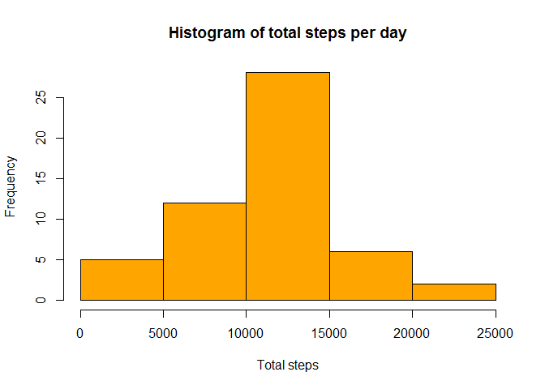
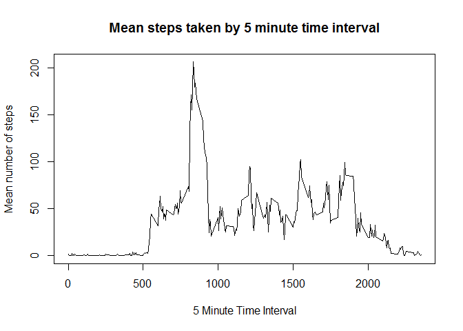
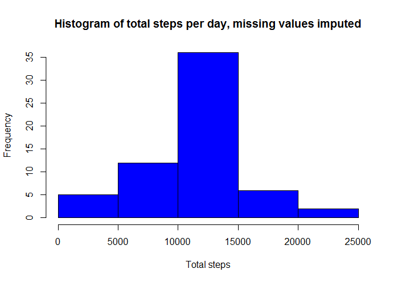
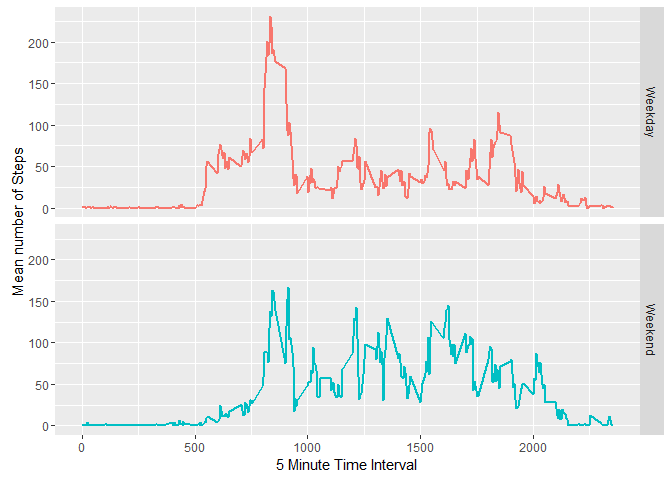

# PA1_template
ecidonex  
April 16, 2016  

##Reproducible Research - Coursera - Assignment 1##

##Introduction
 
This is an analysis of personal movement data collected from anonymous invididuals during the months of October and November 2012. 

##Data Source

Data set: Available at [https://d396qusza40orc.cloudfront.net/repdata%2Fdata%2Factivity.zip](https://d396qusza40orc.cloudfront.net/repdata%2Fdata%2Factivity.zip)

Files:
activity.csv

Variables:
* steps: Number of steps taken in a 5 minute interval (missing values are NA)
* Date: the date on which the measurement was taken in YYYY-MM-DD format
* interval: Identifier for the 5-minute interval in which measurement was taken 

##Loading and Processing Data

This assumes the zip file is downloaded and extracted in the working directory.
We will load the raw data, and format the dates column as date variables.


```r
activity <- read.csv("activity.csv")
activity$date <- as.Date(activity$date)
```

##Total Steps Taken per Day

We will visualize and describe the total number of steps taken per day. We will create a histogram of steps per day, and report the mean and median of data. 

###Histogram of total number of steps per day

First, we'll create a data frame of the total steps in each day. Then we'll plot a histogram


```r
aggbydate <- aggregate(activity$steps~activity$date, FUN=sum, NA.rm = TRUE)
names(aggbydate) <- c("Dates", "Steps")
```


```r
hist(aggbydate$Steps, main = "Histogram of total steps per day", xlab = "Total steps", col = "orange")
```



###Mean and Median number of steps taken per day

Using the same data frame, we will report the mean and the median of the total steps taken per day


```r
meanSteps <- mean(aggbydate$Steps)
print(paste0("Mean number of steps per day: ", round(meanSteps, digits =2)))
```

```
## [1] "Mean number of steps per day: 10767.19"
```

```r
medianSteps <- median(aggbydate$Steps)
print(paste0("Median number of steps per day: ", round(medianSteps, digits =2)))
```

```
## [1] "Median number of steps per day: 10766"
```

##Average Daily Activity Pattern


###Time series plot of average number of steps taken per time interval

First we will create a data frame of the average number of steps taken per 5 minute interval. Then we will plot this in a time series plot


```r
avgbyinterval <- aggregate(activity$steps~activity$interval, FUN=mean, na.rm=T)
names(avgbyinterval) <- c("Interval", "Mean Steps")

plot(avgbyinterval$Interval, avgbyinterval$`Mean Steps`, type = "l", xlab = "5 Minute Time Interval", ylab = "Mean number of steps", main = "Mean steps taken by 5 minute time interval")
```



###Interval with the maximum number of steps


```r
print(paste0("Interval ", avgbyinterval[which.max(avgbyinterval$`Mean Steps`),]$Interval, " has the highest mean steps, with ", round(avgbyinterval[which.max(avgbyinterval$`Mean Steps`),]$'Mean Steps', digits =2), " steps."))
```

```
## [1] "Interval 835 has the highest mean steps, with 206.17 steps."
```

##Imputing Missing Values

The data does have a fair number of missing values. We'll count the number of missing values in the data:


```r
print(paste0("There are ", sum(is.na(activity$steps)), " missing values in the dataset."))
```

```
## [1] "There are 2304 missing values in the dataset."
```

We will impute the missing values: First we'll copy the original data into a new frame. Then we will replace the missing values with the mean of the other values for that interval


```r
actNoNas <- activity
for(i in which(is.na(actNoNas))){
  interval <- actNoNas[i,3]
  actNoNas[i,1] <- avgbyinterval[which(avgbyinterval$Interval == interval),2]
}
```

We will then re-do some of our analyses: first creating a frame aggregated by date, then plotting a new histogram of the data and describing the mean and median


```r
##aggregate data frame by date with missing values imputed
aggNoNas <- aggregate(actNoNas$steps~actNoNas$date, FUN=sum, NA.rm = TRUE)
names(aggNoNas) <- c("Dates", "Steps")

##create a histogram of new data frame with values imputed
hist(aggNoNas$Steps, main = "Histogram of total steps per day, missing values imputed", xlab = "Total steps", col = "blue")
```



```r
## report mean and median of new data frame with values imputed
meanSteps <- mean(aggNoNas$Steps)
print(paste0("After imputing missing values, the mean number of steps per day: ", round(meanSteps, digits =2)))
```

```
## [1] "After imputing missing values, the mean number of steps per day: 10767.19"
```

```r
medianSteps <- median(aggbydate$Steps)
print(paste0("After imputing missing values, the median number of steps per day: ", round(medianSteps, digits =2)))
```

```
## [1] "After imputing missing values, the median number of steps per day: 10766"
```

While there were a fair number missing values, imputing those values did not make major changes to the description of the data. The median has shifted closer to the mean.

##Comparing Weekend and Weekday Activity Patterns

In this section we will see how steps taken differ between weekdays and weekends.First we will add a variable to the data to classify each observation as taking place on a weekend of weekday:


```r
##create a function to tell if a given date is weekend or weekday
we <- function(date){ 
  day <- weekdays(date)
  if(day %in% c("Monday","Tuesday","Wednesday","Thursday","Friday"))
    return("Weekday")
  else if (day %in% c("Saturday", "Sunday"))
    return("Weekend")
  else
    stop("An invalid date was encountered")
}

##create a new variable in our imputed dataset, and fill with weekday or weekend
actNoNas$Day <- sapply(actNoNas$date, FUN=we)
```

Then we will take the mean of steps in each time interval, stratified by weekday vs weekend. We will plot the average steps per time interval to compare them between weekend days and weekday days.


```r
library(ggplot2)
```

```
## Warning: package 'ggplot2' was built under R version 3.2.3
```

```r
avgbyintdays <- aggregate(steps ~ interval + Day, data = actNoNas, FUN = mean)

ggplot(avgbyintdays, aes(interval, steps, colour = Day)) + geom_line(size =1) +facet_grid(Day ~ .)+guides(colour =FALSE) + xlab("5 Minute Time Interval")+ylab("Mean number of Steps")
```



